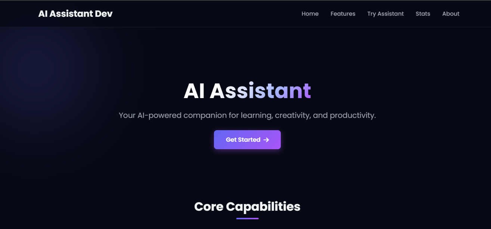
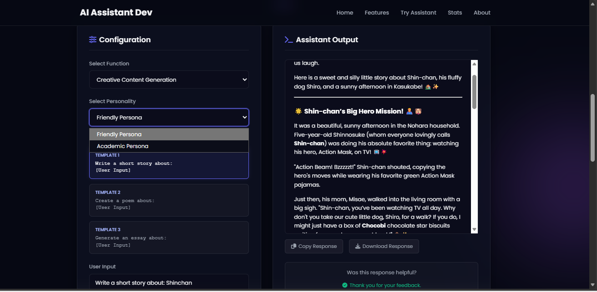
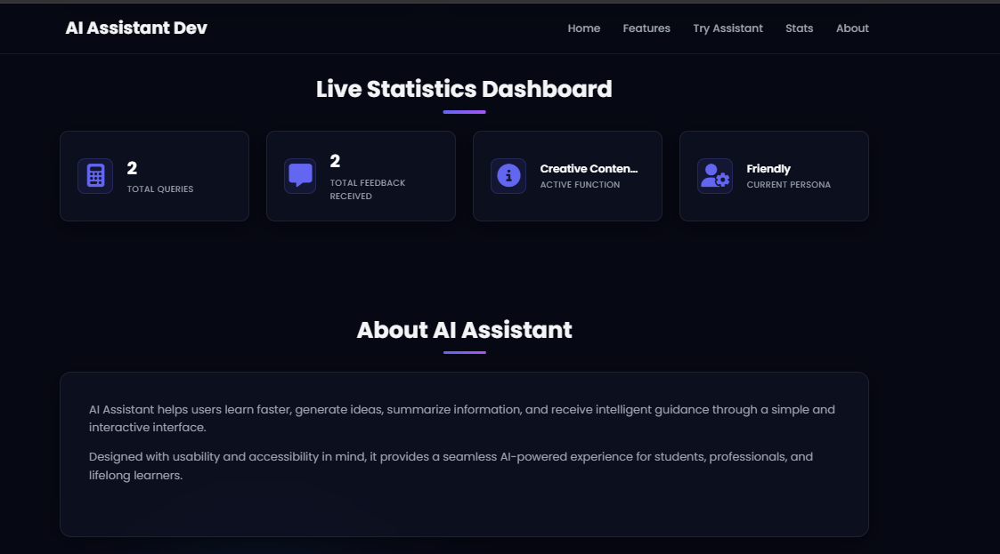

# AI Assistant Development (Prompt Engineering Major Project)

An interactive, production-ready, SaaS-style AI assistant application showcasing fundamental **Prompt Engineering** techniques integrated with the **Google Gemini API**. Built as an internship major project.

**Developer:** Bugata Pravallika
**Project Objective:** Design and implement a web-based AI Assistant that demonstrates Prompt Engineering concepts and can perform multiple AI-powered tasks using the Gemini API.

---

## 🚀 Live Demo & Deployment
- **Deployment Platform:** [Render](https://render.com)
- **AI Backend:** Google Gemini API (`gemini-1.5-flash`)
- **Version Control:** GitHub

---

## ✨ Features

### 1. Functional Core Capabilities (4 Modes)
*   **Question Answering:** Factual and academic explanations with customizable templates.
*   **Text Summarization:** Condensing long textual documents into key points or main summaries.
*   **Creative Content Generation:** Prompt structures to write poems, short stories, and academic essays.
*   **Study Advice & Recommendations:** Custom curriculum roadmaps, preparation advice, and placement guides.

### 2. Prompt Engineering Framework
*   **3 Prompt Templates per Function:** Instantly view and switch between 3 distinct pre-engineered templates to see how different phrasing influences AI outputs.
*   **Dynamic Variable Substitution:** Interactive rendering of `{user_input}` parameters in the UI.

### 3. Dual Persona System
*   **Friendly Persona:** Encouraging, beginner-friendly, warm explanations with helpful emojis.
*   **Academic Persona:** Formal, detailed, pedagogical explanations using precise terms and structures.
*   *Implementation:* Under-the-hood system instructions passed dynamically to the Gemini API.

### 4. Advanced UI/UX (SaaS Design)
*   **Dark Mode by Default:** Styled with a premium deep navy, purple, and blue palette.
*   **Glassmorphism UI:** Translucent cards, blurring filters, and subtle ambient background glow blobs.
*   **Interactive Controls:** Fluid template picker cards, clear layout, and responsive flex design.
*   **ChatGPT Style Formatting:** Full support for Markdown parsing, code blocks, and syntax highlighting.
*   **Output Actions:** Single-click copy to clipboard and `.txt` file downloading.
*   **Typing Loading Indicator:** Custom CSS animated dots indicating real-time generation.

### 5. Persistent Feedback Loop
*   Dual helpfulness rating (`👍 Helpful` / `👎 Not Helpful`).
*   Feedback values are automatically saved into `feedback.txt` with time logs, function modes, and prompt structures.
*   Interactive Thank You animation upon submission.

### 6. Live Statistics Dashboard
*   Track total API queries processed.
*   Track total helpfulness feedback received.
*   Show selected function and current persona configuration in real time.

---

## 🛠️ Technology Stack
*   **Backend:** Python 3.10+, Flask
*   **Frontend:** HTML5, CSS3 (Vanilla CSS with Flexbox/Grid), JavaScript (ES6+)
*   **AI SDK:** `google-generativeai`
*   **Markdown Engine:** `marked.js` (loaded via CDN)
*   **Icons:** FontAwesome (loaded via CDN)

---

## 💻 Local Setup & Installation

### Prerequisite
Obtain a Google Gemini API Key from Google AI Studio.

### Step 1: Clone the repository
```bash
git clone <your-repository-url>
cd AI_ASSISTANT_DEVELOPMENT
```

### Step 2: Create a virtual environment and install dependencies
```bash
# Windows
python -m venv venv
venv\Scripts\activate

# Linux/macOS
python3 -m venv venv
source venv/bin/activate

# Install requirements
pip install -r requirements.txt
```

### Step 3: Configure Environment Variables
Create a file named `.env` in the root of the project:
```env
GEMINI_API_KEY=your_actual_gemini_api_key_here
PORT=5000
```
*(Note: If no key is set, the application will run in simulation mode for demonstration purposes without throwing crashes).*

### Step 4: Run the application
```bash
python app.py
```
Open your browser and navigate to `http://127.0.0.1:5000`.

---

## ☁️ Render Deployment Steps

The project includes standard files (`Procfile`, `render.yaml`, `requirements.txt`) to allow quick deployment directly on Render.

1.  **Push to GitHub:** Commit all files and push your repository to GitHub.
2.  **Create a Render Service:**
    *   Sign in to [Render](https://render.com).
    *   Click **New +** > **Blueprint** or **Web Service**.
    *   Select your GitHub repository.
3.  **Configure Environment Variables:**
    *   Under the **Environment** tab, add:
        *   `GEMINI_API_KEY`: *(Your Google Gemini API Key)*
        *   `PYTHON_VERSION`: `3.10.0` (or similar supported version)
4.  **Deploy:** Click **Manual Deploy** (if Blueprint is not used, set Build command as `pip install -r requirements.txt` and Start command as `gunicorn app:app`). Render will automatically provision the service.

---

## 📸 Screenshots

### Landing Page


### Assistant Interface


### Dashboard


---

## 👤 Author
- **Developer Name:** Bugata Pravallika
- **Project Role:** Prompt Engineer & Web Developer
- **Designation:** Internship Major Project Student
